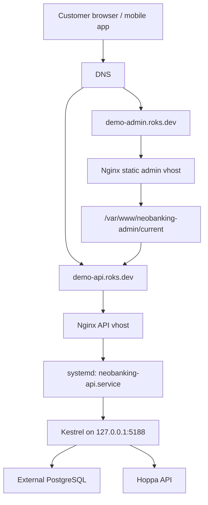
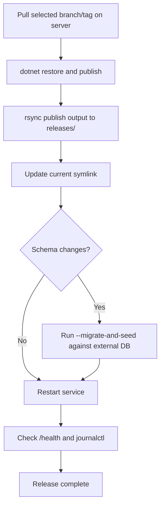
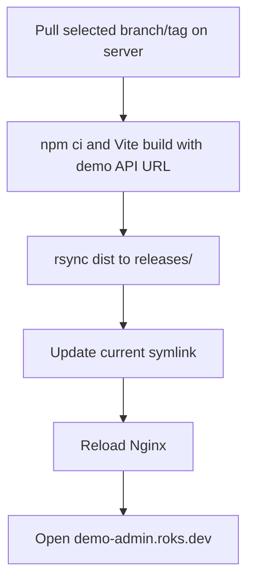

# Ubuntu Deployment Plan: Backend API and Admin Site

This plan deploys the NeoBanking backend and Vue admin site on an Ubuntu server without Docker and without installing PostgreSQL locally.

Target domains:

- API: `demo-api.roks.dev`
- Admin: `demo-admin.roks.dev`

Target services:

- ASP.NET Core backend runs as a `systemd` service on `127.0.0.1:5188`.
- Nginx terminates HTTPS and reverse-proxies `demo-api.roks.dev` to the backend.
- Nginx serves the Vue admin static build for `demo-admin.roks.dev`.
- PostgreSQL remains external. The server only needs network access to the external database host.

## Deployment Architecture



## Assumptions

- Ubuntu server has SSH access with a sudo-capable deploy/admin user.
- DNS `A` or `AAAA` records for both domains point to this server.
- You have an external PostgreSQL connection string.
- You have Hoppa credentials for staging or production.
- The project targets `.NET 10` (`net10.0`), so the server needs the .NET 10 SDK when building directly on the server.
- Admin build uses Vite and must be built with `VITE_BACKEND_API_BASE_URL=https://demo-api.roks.dev`.

## Server Package Setup

Install required server packages:

```bash
sudo apt update
sudo apt install -y nginx curl ca-certificates gnupg unzip rsync git
```

Install the .NET SDK because this plan builds the backend on the server:

```bash
sudo apt update
sudo apt install -y dotnet-sdk-10.0
```

If the package is not available from the default Ubuntu feeds on your server image, add the Microsoft package feed for your Ubuntu version, then install `dotnet-sdk-10.0`.

Install Node.js and npm for the Vue admin build. Use a Node.js version supported by the checked-in admin package lock and Vite version.

```bash
sudo apt install -y nodejs npm
node --version
npm --version
```

This plan assumes the source repository is cloned on the server and builds are created locally on each deployment.

## Linux Users and Directories

Create a dedicated runtime user:

```bash
sudo useradd --system --create-home --home-dir /opt/neobanking --shell /usr/sbin/nologin neobanking
```

Create deployment directories:

```bash
sudo mkdir -p /opt/neobanking/api/releases
sudo mkdir -p /opt/neobanking/api/shared
sudo mkdir -p /var/www/neobanking-admin/releases
sudo chown -R neobanking:neobanking /opt/neobanking
sudo chown -R www-data:www-data /var/www/neobanking-admin
```

Recommended layout:

```text
/opt/neobanking/api/current -> /opt/neobanking/api/releases/<release-id>
/opt/neobanking/api/shared/neobanking-api.env
/home/rokkogovsek/hoppa_demo_app
/var/www/neobanking-admin/current -> /var/www/neobanking-admin/releases/<release-id>
```

## Source Checkout

The source repository lives on the server at:

```bash
cd /home/rokkogovsek/hoppa_demo_app
```

For each deployment, update the checkout:

```bash
cd /home/rokkogovsek/hoppa_demo_app
git fetch --all --prune
git checkout <branch-or-tag>
git pull --ff-only
```

Use a release branch or tag for predictable deployments.

## One-Command Redeploy Script

This repository includes a server deployment script:

```bash
cd /home/rokkogovsek/hoppa_demo_app
./scripts/deploy-ubuntu.sh
```

It pulls git changes, builds the backend API, builds the Vue admin website with `VITE_BACKEND_API_BASE_URL=https://demo-api.roks.dev`, installs both into timestamped release folders, restarts `neobanking-api`, checks local API health, validates Nginx, reloads Nginx, and keeps the newest five releases.

Common options:

```bash
./scripts/deploy-ubuntu.sh --branch main
./scripts/deploy-ubuntu.sh --migrate
./scripts/deploy-ubuntu.sh --skip-admin
./scripts/deploy-ubuntu.sh --skip-api
./scripts/deploy-ubuntu.sh --skip-pull
```

The manual deployment steps below are useful for debugging or for running only part of the deployment by hand.

## Backend Configuration

Store production configuration in an environment file outside the release folder:

```bash
sudo install -o root -g neobanking -m 0640 /dev/null /opt/neobanking/api/shared/neobanking-api.env
sudo nano /opt/neobanking/api/shared/neobanking-api.env
```

Example:

```ini
ASPNETCORE_ENVIRONMENT=Production
ASPNETCORE_URLS=http://127.0.0.1:5188

ConnectionStrings__NeoBankingDb="Host=<external-postgres-host>;Port=5432;Database=<database>;Username=<user>;Password=<password>;SSL Mode=Require;Trust Server Certificate=true"

Jwt__Issuer=NeoBanking
Jwt__Audience=NeoBanking.Api
Jwt__SigningKey="<32-byte-or-longer-secret>"
Jwt__ClockSkewSeconds=60

Company__InstallationId=demo
Company__Name="Demo Company"
Company__BrandName=Demo
Company__Branding__LogoUrl=
Company__Branding__PrimaryColor="#2563EB"
Company__Branding__SupportEmail=support@roks.dev
Company__Branding__TermsUrl=https://demo-admin.roks.dev/terms
Company__Branding__PrivacyUrl=https://demo-admin.roks.dev/privacy

Hoppa__BaseUrl=https://staging.hoppa.global/
Hoppa__ApiKey="<hoppa-api-key>"
Hoppa__WebhookSecret="<hoppa-webhook-secret>"
Hoppa__TimeoutSeconds=30

SeedAdmin__Email=<admin-email>
SeedAdmin__Password="<temporary-admin-password>"
SeedAdmin__DisplayName="Demo Admin"
```

Notes:

- Do not commit this file.
- Do not place Hoppa keys in admin or mobile frontend configuration.
- Do not install PostgreSQL locally for this plan; the app uses `ConnectionStrings__NeoBankingDb` to connect to the external database.

## Build Backend On Server

From the server source checkout:

```bash
cd /home/rokkogovsek/hoppa_demo_app
RELEASE_ID=$(date +%Y%m%d%H%M%S)
PUBLISH_DIR=/tmp/neobanking-api-$RELEASE_ID

dotnet restore backend/NeoBanking.sln
dotnet publish backend/src/NeoBanking.Api/NeoBanking.Api.csproj \
  -c Release \
  -o $PUBLISH_DIR
```

Install as a new release on the server:

```bash
sudo mkdir -p /opt/neobanking/api/releases/$RELEASE_ID
sudo rsync -a --delete $PUBLISH_DIR/ /opt/neobanking/api/releases/$RELEASE_ID/
sudo chown -R neobanking:neobanking /opt/neobanking/api/releases/$RELEASE_ID
sudo ln -sfn /opt/neobanking/api/releases/$RELEASE_ID /opt/neobanking/api/current
rm -rf $PUBLISH_DIR
```

## systemd Service

Create the service:

```bash
sudo nano /etc/systemd/system/neobanking-api.service
```

```ini
[Unit]
Description=NeoBanking API
After=network-online.target
Wants=network-online.target

[Service]
WorkingDirectory=/opt/neobanking/api/current
ExecStart=/usr/bin/dotnet /opt/neobanking/api/current/NeoBanking.Api.dll
Restart=always
RestartSec=10
KillSignal=SIGINT
SyslogIdentifier=neobanking-api
User=neobanking
Group=neobanking
EnvironmentFile=/opt/neobanking/api/shared/neobanking-api.env
Environment=DOTNET_PRINT_TELEMETRY_MESSAGE=false

NoNewPrivileges=true
PrivateTmp=true
ProtectSystem=full
ProtectHome=true
ReadWritePaths=/opt/neobanking/api

[Install]
WantedBy=multi-user.target
```

Enable and start:

```bash
sudo systemctl daemon-reload
sudo systemctl enable neobanking-api
sudo systemctl start neobanking-api
sudo systemctl status neobanking-api --no-pager
```

Check local health:

```bash
curl -i http://127.0.0.1:5188/health
```

View logs:

```bash
journalctl -u neobanking-api -f
```

## Database Migration and Seed

This project supports a one-shot migration/seed mode:

```bash
sudo systemd-run \
  --unit=neobanking-api-migrate \
  --wait \
  --pty \
  --property=User=neobanking \
  --property=Group=neobanking \
  --property=WorkingDirectory=/opt/neobanking/api/current \
  --property=EnvironmentFile=/opt/neobanking/api/shared/neobanking-api.env \
  /usr/bin/dotnet /opt/neobanking/api/current/NeoBanking.Api.dll --migrate-and-seed
```

Use it only when you want this API release to apply EF Core migrations to the external PostgreSQL database and seed the admin account.

Operational recommendation:

- Run migrations before restarting into a release that depends on new schema.
- Back up the external database before production migrations.
- Rotate `SeedAdmin__Password` after first login or remove the seed password from the environment file once it is no longer needed.

## Nginx API Site

Create `/etc/nginx/sites-available/demo-api.roks.dev`:

```nginx
server {
    listen 80;
    listen [::]:80;
    server_name demo-api.roks.dev;

    client_max_body_size 50m;

    location / {
        proxy_pass http://127.0.0.1:5188;
        proxy_http_version 1.1;

        proxy_set_header Host $host;
        proxy_set_header X-Real-IP $remote_addr;
        proxy_set_header X-Forwarded-For $proxy_add_x_forwarded_for;
        proxy_set_header X-Forwarded-Proto $scheme;

        proxy_set_header Upgrade $http_upgrade;
        proxy_set_header Connection "";
        proxy_buffering off;
    }
}
```

Enable it:

```bash
sudo ln -sfn /etc/nginx/sites-available/demo-api.roks.dev /etc/nginx/sites-enabled/demo-api.roks.dev
sudo nginx -t
sudo systemctl reload nginx
```

## Build Admin On Server

Build the Vue admin app with the production API URL:

```bash
cd /home/rokkogovsek/hoppa_demo_app
cd admin_vue
npm ci
VITE_BACKEND_API_BASE_URL=https://demo-api.roks.dev npm run build
cd ..
```

Install on the server:

```bash
RELEASE_ID=$(date +%Y%m%d%H%M%S)
sudo mkdir -p /var/www/neobanking-admin/releases/$RELEASE_ID
sudo rsync -a --delete admin_vue/dist/ /var/www/neobanking-admin/releases/$RELEASE_ID/
sudo chown -R www-data:www-data /var/www/neobanking-admin/releases/$RELEASE_ID
sudo ln -sfn /var/www/neobanking-admin/releases/$RELEASE_ID /var/www/neobanking-admin/current
```

## Nginx Admin Site

Create `/etc/nginx/sites-available/demo-admin.roks.dev`:

```nginx
server {
    listen 80;
    listen [::]:80;
    server_name demo-admin.roks.dev;

    root /var/www/neobanking-admin/current;
    index index.html;

    add_header X-Content-Type-Options nosniff;
    add_header X-Frame-Options DENY;
    add_header Referrer-Policy strict-origin-when-cross-origin;

    location / {
        try_files $uri $uri/ /index.html;
    }

    location ~* \.(js|css|png|jpg|jpeg|gif|svg|ico|woff2?)$ {
        expires 30d;
        add_header Cache-Control "public, immutable";
        try_files $uri =404;
    }
}
```

Enable it:

```bash
sudo ln -sfn /etc/nginx/sites-available/demo-admin.roks.dev /etc/nginx/sites-enabled/demo-admin.roks.dev
sudo nginx -t
sudo systemctl reload nginx
```

## TLS Certificates

Install Certbot:

```bash
sudo apt install -y certbot python3-certbot-nginx
```

Issue certificates:

```bash
sudo certbot --nginx -d demo-api.roks.dev -d demo-admin.roks.dev
```

Verify auto-renewal:

```bash
sudo certbot renew --dry-run
```

After TLS is enabled, verify:

```bash
curl -i https://demo-api.roks.dev/health
curl -I https://demo-admin.roks.dev
```

## Firewall

Allow only SSH, HTTP, and HTTPS:

```bash
sudo ufw allow OpenSSH
sudo ufw allow 'Nginx Full'
sudo ufw enable
sudo ufw status
```

The backend port `5188` should remain bound to `127.0.0.1` and should not be exposed through the firewall.

## Release Procedure

Recommended backend release sequence:



Commands:

```bash
sudo systemctl restart neobanking-api
sudo systemctl status neobanking-api --no-pager
curl -i https://demo-api.roks.dev/health
```

Recommended admin release sequence:



## Rollback

List available releases:

```bash
ls -1 /opt/neobanking/api/releases
ls -1 /var/www/neobanking-admin/releases
```

Rollback backend:

```bash
sudo ln -sfn /opt/neobanking/api/releases/<previous-release-id> /opt/neobanking/api/current
sudo systemctl restart neobanking-api
curl -i https://demo-api.roks.dev/health
```

Rollback admin:

```bash
sudo ln -sfn /var/www/neobanking-admin/releases/<previous-release-id> /var/www/neobanking-admin/current
sudo nginx -t
sudo systemctl reload nginx
```

If a migration was already applied, application rollback may also require database rollback or a forward-fix migration. Do not assume code rollback reverses database schema changes.

## Verification Checklist

- DNS for `demo-api.roks.dev` resolves to the server.
- DNS for `demo-admin.roks.dev` resolves to the server.
- `systemctl status neobanking-api` is active.
- `curl http://127.0.0.1:5188/health` works on the server.
- `curl https://demo-api.roks.dev/health` works externally.
- `https://demo-admin.roks.dev` loads the Vue admin shell.
- Browser network calls from the admin site go to `https://demo-api.roks.dev/api/v1/admin/*`.
- Backend can reach external PostgreSQL.
- Backend can reach Hoppa.
- No Hoppa API key exists in `/var/www/neobanking-admin/current`.
- No PostgreSQL service is installed or running locally unless intentionally added later.

## Troubleshooting

Backend fails to start:

```bash
journalctl -u neobanking-api -n 200 --no-pager
sudo systemctl status neobanking-api --no-pager
```

Nginx config errors:

```bash
sudo nginx -t
sudo journalctl -u nginx -n 100 --no-pager
```

External database connectivity:

```bash
nc -vz <external-postgres-host> 5432
```

API behind Nginx unavailable:

```bash
curl -i http://127.0.0.1:5188/health
curl -i http://demo-api.roks.dev/health
curl -i https://demo-api.roks.dev/health
```

Admin uses wrong API URL:

```bash
grep -R "localhost:5188\\|demo-api.roks.dev" /var/www/neobanking-admin/current
```

If `localhost:5188` appears in the built admin files, rebuild with:

```bash
VITE_BACKEND_API_BASE_URL=https://demo-api.roks.dev npm run build
```
