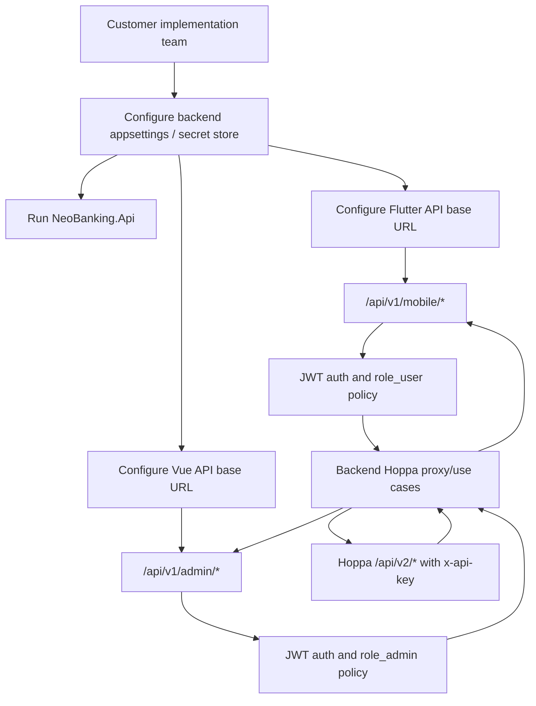
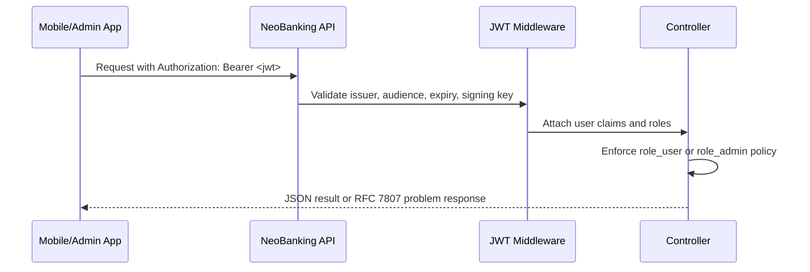
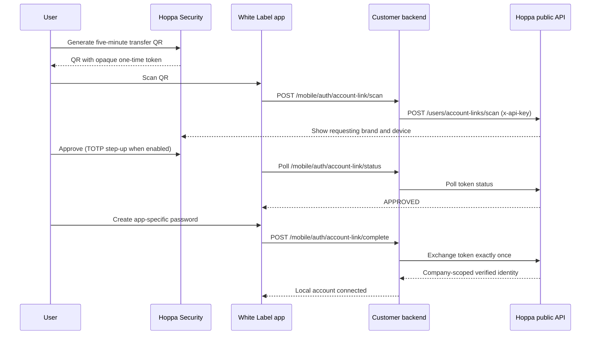
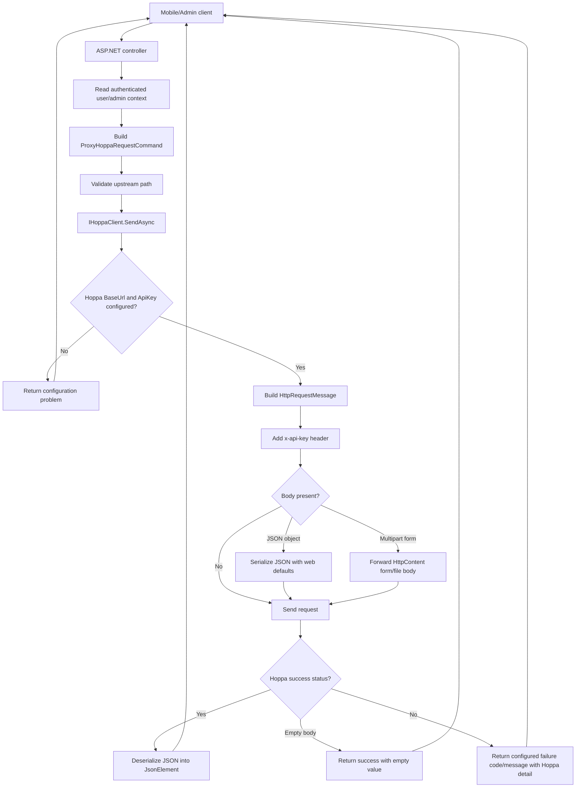
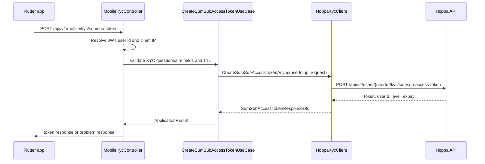
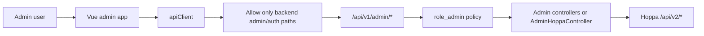

# Customer Implementation Guide

This project is a white-label NeoBanking implementation with three customer-facing surfaces:

- `backend`: ASP.NET Core API, authentication, authorization, Hoppa API integration, company context, and webhook entrypoints.
- `mobile_flutter`: Flutter mobile application that calls the backend mobile API.
- `admin_vue`: Vue admin application that calls the backend admin API.

Customers should integrate with the backend APIs in this repository. The mobile and admin apps must not call Hoppa directly. Hoppa credentials, Hoppa base URLs, and provider request signing stay in the backend.

## Implementation Flow



## Required Configuration

Start from `backend/src/NeoBanking.Api/appsettings.Example.json` and move real secrets into your deployment secret store.

```json
{
  "Company": {
    "Features": {
      "ReferralsEnabled": false,
      "ReferralRegistrationMode": "optional",
      "VouchersEnabled": false,
      "ExistingAccountClaimEnabled": false,
      "EqualsMoneyEnabled": true,
      "BoomFiExchangeEnabled": false,
      "BusinessOnboardingEnabled": true
    }
  },
  "Hoppa": {
    "BaseUrl": "https://staging.hoppa.global/",
    "ApiKey": "replace-with-secret",
    "WebhookSecret": "replace-with-secret",
    "SumSubWebhookSecret": "replace-with-secret",
    "TimeoutSeconds": 30
  }
}
```

The backend reads this section through `HoppaOptions` and registers two typed `HttpClient` integrations:

- `IHoppaClient` for general Hoppa proxy calls.
- `IHoppaKycClient` for the SumSub access-token flow.

Customer checklist:

- Configure `ConnectionStrings:NeoBankingDb`.
- Configure `Jwt:Issuer`, `Jwt:Audience`, and a secure `Jwt:SigningKey`.
- Configure the `Company` section for the customer brand and installation.
- Enable referrals and vouchers only after the matching Hoppa company modules are active. Set `ReferralRegistrationMode` to `optional` or `required`.
- Enable `ExistingAccountClaimEnabled` only after Hoppa account-link and email-claim endpoints are deployed for the configured company.
- Set `BusinessOnboardingEnabled` to `false` for personal-only installations: signup hides the business account type, `POST /api/v1/mobile/auth/signup` rejects `accountType=business`, and `/api/v1/mobile/business-onboarding/*` returns 404. Set `EqualsMoneyEnabled` to `false` to run with Interlace crypto cards only.
- Configure `Hoppa:BaseUrl`, `Hoppa:ApiKey`, both webhook secrets, and timeout.
- Configure the `Email` section (provider, sender address, SendGrid API key) so password reset and email confirmation codes can be delivered.
- Point `mobile_flutter` and `admin_vue` to the backend base URL only.

## Authentication Model

The backend uses JWT bearer auth.



Mobile endpoints use `AuthorizationPolicyNames.User`. Admin endpoints use `AuthorizationPolicyNames.Admin`.

The mobile API resolves the Hoppa user id from one of these JWT claims:

- `ClaimTypes.NameIdentifier`
- `sub`
- `user_id`
- `uid`

If none are present, the backend returns `401` with code `identity.missing`.

## Frontend Integration Rule

Frontend clients call only the backend:

- Flutter uses `Dio` from `mobile_flutter/lib/core/api/dio_provider.dart`.
- Vue admin uses Axios from `admin_vue/src/lib/apiClient.ts`.

The Vue admin client actively blocks direct external API calls and only allows `/api/v1/admin/*` and `/api/v1/auth/*` backend paths. Flutter attaches the backend JWT through `auth_token_provider`.

Do not put Hoppa URLs or Hoppa API keys in mobile or admin code.

## Existing Hoppa Account Transfer

An existing Hoppa user can connect a new customer app without copying a password or moving funds. QR transfer is the preferred flow; email OTP is the fallback.



Security requirements:

- The QR contains only a version, challenge id, and 256-bit random token; it contains no email, user id, or balance data.
- The customer backend, never the Flutter app, calls Hoppa with the company API key.
- Hoppa stores only the token fingerprint and enforces company scope, a five-minute expiry, explicit approval, and one-time exchange.
- QR payloads and tokens must be redacted from request/response logs.
- The dashboard user must recognize the displayed White Label brand and device. TOTP is required for approval when enabled.
- The local password is app-specific. The existing Hoppa password is neither requested nor changed.

Customer mobile routes:

| Step | Template endpoint | Hoppa endpoint |
| --- | --- | --- |
| Scan | `POST /api/v1/mobile/auth/account-link/scan` | `POST /api/v2/users/account-links/scan` |
| Poll | `POST /api/v1/mobile/auth/account-link/status` | `POST /api/v2/users/account-links/status` |
| Complete | `POST /api/v1/mobile/auth/account-link/complete` | `POST /api/v2/users/account-links/exchange` |
| Email fallback | `/api/v1/mobile/auth/account-claim/*` | `/api/v2/users/account-claim/challenges*` |

## Backend Hoppa Call Lifecycle



Important implementation files:

- `backend/src/NeoBanking.Infrastructure/Hoppa/HoppaServiceCollectionExtensions.cs`
- `backend/src/NeoBanking.Infrastructure/Hoppa/HoppaClient.cs`
- `backend/src/NeoBanking.Application/UseCases/Hoppa/ProxyHoppaRequestUseCase.cs`
- `backend/src/NeoBanking.Api/Controllers/HoppaProxyControllerBase.cs`

## Error Response Contract

Provider and validation failures are returned as RFC 7807-style problem responses.

Example shape:

```json
{
  "type": "https://api.neobanking.local/problems/mobile.cards.list.failed",
  "title": "Hoppa failed to list cards.",
  "status": 502,
  "detail": "<raw Hoppa error body or transport detail>",
  "instance": "/api/v1/mobile/cards",
  "code": "mobile.cards.list.failed",
  "traceId": "<aspnet-trace-id>"
}
```

Common backend-generated error codes:

| Code | Meaning |
| --- | --- |
| `hoppa.configuration.missing_base_url` | `Hoppa:BaseUrl` is missing. |
| `hoppa.configuration.missing_api_key` | `Hoppa:ApiKey` is missing. |
| `hoppa.path.invalid` | A controller tried to send an invalid upstream path. |
| `hoppa.timeout` | Hoppa did not respond before timeout. |
| `hoppa.unavailable` | Network or HTTP transport error while calling Hoppa. |
| `hoppa.invalid_response` | Hoppa returned malformed JSON. |
| `identity.missing` | A mobile endpoint could not resolve the authenticated user id. |

## KYC and SumSub Flow

The mobile app never calls SumSub or Hoppa directly to create a token. It calls:

```http
POST /api/v1/mobile/kyc/sumsub-token
Authorization: Bearer <user-jwt>
Content-Type: application/json
```

Required request fields:

- `occupation`
- `annualSalary`
- `accountPurpose`
- `expectedMonthlyVolume`
- `documentIssueDate`

The backend validates the request, reads the client IP address from `X-Forwarded-For`, `X-Real-IP`, or the remote connection, and calls Hoppa:

```http
POST /api/v2/users/{userId}/kyc/sumsub-access-token
x-api-key: <server-side-hoppa-api-key>
```



## Mobile Implementation Order

For a typical customer mobile rollout:

1. Authenticate the user and store the backend JWT.
2. Load branding from the backend if the app is white-labelled.
3. Start onboarding and KYC.
4. Create a SumSub token through the backend and launch the SumSub SDK.
5. Poll KYC or onboarding status through the backend.
6. Load accounts, balances, wallets, cards, tiers, transactions, and payments as needed.
7. Create money-movement operations through backend routes.

Typical mobile route groups:

| Customer feature | Backend route prefix | Hoppa upstream pattern |
| --- | --- | --- |
| Personal onboarding | `/api/v1/mobile/onboarding` | `/api/v2/users/{userId}/onboarding/*` |
| KYC and SumSub | `/api/v1/mobile/kyc` | `/api/v2/users/{userId}/kyc/*`, `/api/v2/users/{userId}/sumsub/*` |
| Business onboarding | `/api/v1/mobile/business-onboarding` | `/api/v2/business/onboarding/*` |
| Company configuration | `/api/v1/mobile/config` | Local tenant-safe feature and branding projection |
| Referrals and vouchers | `/api/v1/mobile/rewards` | `/api/v2/users/{userId}/referrals/*`, `/api/v2/vouchers/*` |
| Banking, balances, budgets, payees | `/api/v1/mobile/banking` | `/api/v2/banking/*`, `/api/v2/banking/users/{userId}/*` |
| Cards | `/api/v1/mobile/cards` | `/api/v2/cards/*` |
| Tiers | `/api/v1/mobile/tiers` | `/api/v2/tiers/*`, `/api/v2/users/{userId}/tier` |
| Payments | `/api/v1/mobile/payments` | `/api/v2/payments/*` |
| Transfers and crypto movement | `/api/v1/mobile/transfers` | `/api/v2/transfers/*` |
| Wallets and assets | `/api/v1/mobile/wallets`, `/api/v1/mobile/assets` | `/api/v2/users/{userId}/wallets`, `/api/v2/users/{userId}/assets` |
| Transactions | `/api/v1/mobile/transactions` | `/api/v2/transactions/*` |

## Admin Implementation Order

For a customer admin rollout:

1. Authenticate admins with a JWT carrying the admin role.
2. Load dashboard and resource tables from `/api/v1/admin/*`.
3. Use `/api/v1/admin/hoppa/*` for generic Hoppa-backed admin resources and actions exposed by the Vue admin resource config.
4. Keep operational actions server-mediated: approvals, card actions, KYC decisions, transaction sync, exports, and support reports.



The generic admin proxy rejects `/api/v2/admin/*` paths because those routes are not published in the customer OpenAPI contract. Add customer features only from the exported public specification, currently represented by `https://staging.hoppa.global/openapi/v1.json`.

## Referral and Voucher Flow

The app loads `/api/v1/mobile/config` before signup. Referral entry is hidden when the customer template disables referrals, optional or required according to `ReferralRegistrationMode`, validated through the public `check-referral` route, and attributed only after Hoppa creates the user. Signed-in reward calls always derive the Hoppa user id from the JWT; clients cannot submit another user id.

Voucher code redemption follows a validate-then-redeem flow. Assigned commission vouchers use the user-scoped referral voucher routes, while typed codes use the public voucher validation and redemption routes. The backend exposes only the effective voucher availability and shutdown mode rather than the full company voucher settings response.

## Adding a New Hoppa-Backed Feature

Use this process when customers need to add a Hoppa endpoint that is not yet exposed.

1. Add or extend a backend controller route under `/api/v1/mobile/*` or `/api/v1/admin/*`.
2. Resolve the authenticated user id for user-scoped mobile calls.
3. Build the Hoppa upstream path with `Segment(...)` for every path parameter.
4. Put optional query values in `Query(...)`; null or blank values are omitted before sending to Hoppa.
5. Use `ProxyHoppaRequestCommand<TRequest>` or `SendHoppaAsync(...)`.
6. Add a clear `FailureCode` and customer-safe `FailureMessage`.
7. Add frontend API methods that call the backend route only.
8. Add or update tests/static validation for route coverage and the backend-only Hoppa rule.

Example backend pattern:

```csharp
return ToActionResult(await SendHoppaAsync(
    HttpMethod.Post,
    $"/api/v2/users/{Segment(userId)}/tier",
    request,
    "mobile.tiers.select.failed",
    "Hoppa failed to select tier.",
    cancellationToken));
```

## Webhooks

The backend currently declares public webhook entrypoints:

```http
POST /api/v1/webhooks/hoppa
POST /api/v1/webhooks/sumsub
```

Both validate HMAC signatures and reject placeholder or missing secrets. Hoppa uses `X-Hoppacard-Signature`; SumSub uses `X-Payload-Digest`. Event ids are persisted for retry-safe processing and provider state updates.

## Push Notifications

Hoppa webhook events are converted into customer-safe Firebase notifications after the webhook has been authenticated, deduplicated, persisted, and matched to a local user. The webhook request does not wait for Firebase: a background dispatcher claims outbox rows, sends in batches, retries transient failures with backoff, and disables permanently invalid device tokens.

Useful user-facing events currently include:

- identity, KYC, KYB, cardholder approval, rejection, and additional-information requests;
- incoming payments, returned payments, and completed outgoing payments or transfers;
- completed or cancelled exchanges;
- wallet credits, withdrawals, refunds, and Equals Money budget movements;
- card funding, unloads, refunds, transactions, shipping, and 3DS confirmation requests.

Intermediate provider events without a useful customer action are deliberately suppressed. Notification payload routes are also checked against a mobile allowlist before navigation.

The authenticated Flutter app registers and unregisters its FCM token through:

```http
POST /api/v1/mobile/notifications/devices
POST /api/v1/mobile/notifications/devices/unregister
```

Apply the `AddPushNotifications` EF migration, then configure the backend through the deployment secret store:

```text
PushNotifications__Enabled=true
PushNotifications__FirebaseProjectId=hoppa-a6b7c
PushNotifications__ServiceAccountPath=/run/secrets/firebase-service-account.json
PushNotifications__MaxAttempts=5
```

Application Default Credentials can be used instead of `ServiceAccountPath`. Never commit a Firebase service-account JSON file. The Android `google-services.json` and iOS `GoogleService-Info.plist` identify the public client apps and are not server credentials.

For a customer white label, register Firebase apps whose Android package and iOS bundle identifiers match that customer's native app. Replace both native configuration files and pass any non-default values through the `FIREBASE_*` Dart defines described in `mobile_flutter/README.md`.

iOS delivery also requires an APNs authentication key or certificate in Firebase Cloud Messaging settings, plus the Push Notifications entitlement in the Apple provisioning profile. Android 13+ asks the user for notification permission at runtime.

## Transactional Email

The backend sends three customer emails through an admin-editable template layer:

| Template key | Trigger | Backend endpoint(s) |
| --- | --- | --- |
| `password_reset` | Customer taps "Forgot password" | `POST /api/v1/mobile/auth/password/forgot` then `POST /api/v1/mobile/auth/password/reset` |
| `email_verification` | Account created via signup | `POST /api/v1/mobile/auth/signup` sends it; `POST /api/v1/mobile/auth/email/verify` confirms, `POST /api/v1/mobile/auth/email/resend` re-issues |
| `account_connected` | Existing Hoppa account connected by email code or QR transfer | `POST /api/v1/mobile/auth/account-claim/complete`, `POST /api/v1/mobile/auth/account-link/complete` |

Codes are six digits, hashed at rest (`user_verification_codes`), expire after `Email:PasswordResetCodeMinutes` / `Email:VerificationCodeMinutes`, allow five wrong attempts, and re-issue at most once per `Email:ResendCooldownSeconds`. "Request a code" endpoints always answer `202` so accounts cannot be enumerated. A successful password reset revokes every refresh session for the user.

Configuration (`Email` section):

```json
"Email": {
  "Provider": "sendgrid",
  "FromEmail": "no-reply@example.com",
  "FromName": "Customer App Name",
  "ReplyToEmail": "support@example.com",
  "MaxAttempts": 5,
  "VerificationCodeMinutes": 15,
  "PasswordResetCodeMinutes": 15,
  "ResendCooldownSeconds": 60,
  "RequireVerifiedEmailForLogin": false,
  "SendGrid": { "ApiKey": "<secret>", "Host": null, "SandboxMode": false }
}
```

- `Provider` is `sendgrid`, `log` (writes the rendered email to the application log; use for local development), or `disabled`.
- Keep the SendGrid key out of committed files: set `Email__SendGrid__ApiKey` in the deployment environment.
- `RequireVerifiedEmailForLogin` blocks sign-in for customers whose email is unconfirmed. Admins are exempt, and the migration that added the flag marks all pre-existing users as verified.
- Emails are written to the `email_messages` outbox and delivered by the `EmailDispatcher` hosted service with exponential back-off, mirroring push notifications.

Admin editing: the **Email templates** page in `admin_vue` (`/email-templates`, backed by `/api/v1/admin/email-templates`) lets operators change the subject, HTML body, and plain-text body per template, toggle a template off, restore the built-in default, preview with sample data, send a test email, and review recent deliveries. Templates use `{{placeholder}}` tokens; the backend rejects unknown placeholders and requires `{{code}}` in the two code-based templates. Placeholder values are HTML-escaped inside the HTML body. Company values (`appName`, `companyName`, `supportEmail`, `brandColor`) come from the `Company` configuration section.

The Flutter app does not yet expose the forgot-password, email-confirmation, or resend screens; wire them to the endpoints above.

### Editing templates in the admin panel

`/email-templates` has two editing modes. **Visual** edits only the heading and the content block of
the shared layout (a rich-text editor with placeholder buttons; "Large code line" is the styled
one-time-code block), so admins never touch the frame, header or footer. **HTML** exposes the whole
document. The visual editor relies on the `<!--heading:start-->…<!--heading:end-->` and
`<!--content:start-->…<!--content:end-->` markers emitted by `EmailTemplateCatalog.Layout`; a
template whose HTML lost those markers falls back to HTML mode until it is reset to the default.
Content styling comes from the `.email-content` rules in the layout head, so rich-text output needs
no inline styles.

## Validation

Run the static validation before customer handoff:

```bash
npm --prefix tests test
```

The validation suite checks route coverage, backend-only Hoppa rules, frontend API boundaries, SumSub route usage, and coverage against the local Hoppa OpenAPI source when available.
